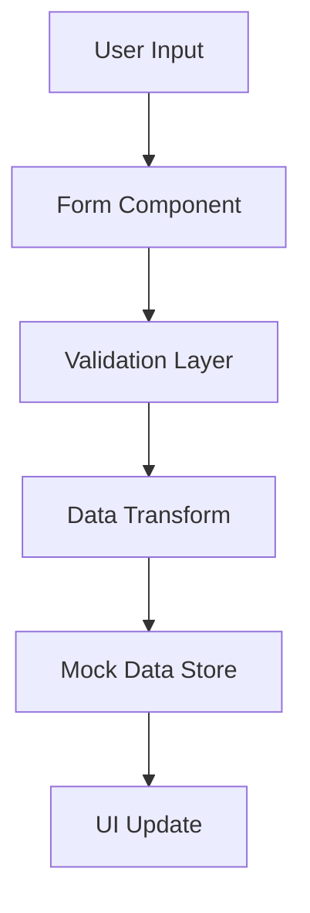

# Technical Documentation

## Architecture Overview

The Model Inventory Management System follows a component-based architecture using React and TypeScript. The system is designed to be modular, maintainable, and scalable.

### Core Components

1. **Model List (`ModelList.tsx`)**
   - Displays all models in a grid layout
   - Implements filtering and search functionality
   - Uses pagination for large datasets
   - Integrates with the search and filter components

2. **Model Detail (`ModelDetail.tsx`)**
   - Shows comprehensive model information
   - Organized in sections for better readability
   - Implements edit and delete functionality
   - Handles data validation and error states

3. **Model Form (`ModelForm.tsx`)**
   - Handles both creation and editing of models
   - Uses React Hook Form for form management
   - Implements Zod schema validation
   - Supports dynamic field arrays for schema tables

### Data Flow



### State Management

- Uses React's built-in state management
- Implements context where needed for shared state
- Maintains form state using React Hook Form
- Handles loading and error states consistently

### Validation

1. **Schema Validation**
   - Uses Zod for type-safe schema validation
   - Implements custom validation rules
   - Handles complex nested objects
   - Provides meaningful error messages

2. **Form Validation**
   - Real-time field validation
   - Custom validation rules
   - Cross-field validation
   - Async validation support

### Component Hierarchy

```
App
├── Navigation
├── ModelList
│   ├── SearchFilters
│   └── ModelCard
├── ModelDetail
│   └── MetadataSection
└── ModelForm
    ├── BasicInfoSection
    ├── TechnicalDetailsSection
    ├── TeamSection
    ├── SchemaSection
    ├── InfrastructureSection
    ├── ServiceNowSection
    ├── AnomaloSection
    └── SLASection
```

### Styling Architecture

1. **Tailwind CSS**
   - Custom color scheme
   - Responsive design utilities
   - Custom component classes
   - Theme configuration

2. **Component Styling**
   - Consistent spacing system
   - Responsive breakpoints
   - Custom animations
   - Accessibility considerations

### Error Handling

1. **Form Errors**
   - Field-level validation
   - Form-level validation
   - Async validation
   - Error message display

2. **API Errors**
   - Error boundaries
   - Loading states
   - Error recovery
   - User feedback

### Performance Considerations

1. **Optimization**
   - React.memo for expensive components
   - Debounced search
   - Virtualized lists
   - Lazy loading

2. **Code Splitting**
   - Route-based splitting
   - Component-based splitting
   - Dynamic imports
   - Prefetching

### Testing Strategy

1. **Unit Tests**
   - Component testing
   - Hook testing
   - Utility function testing
   - Form validation testing

2. **Integration Tests**
   - Form submission flows
   - Navigation flows
   - Filter and search functionality
   - Error handling

### Security Considerations

1. **Input Validation**
   - Data sanitization
   - XSS prevention
   - CSRF protection
   - Input constraints

2. **Authentication**
   - Role-based access
   - Session management
   - Secure routing
   - Permission checks

### Deployment

1. **Build Process**
   - Asset optimization
   - Code minification
   - Tree shaking
   - Environment configuration

2. **CI/CD**
   - Automated testing
   - Build verification
   - Deployment automation
   - Environment management